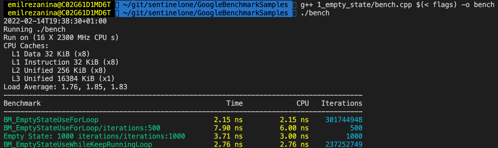
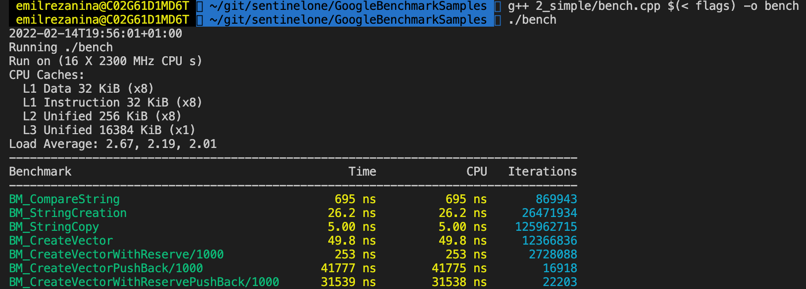
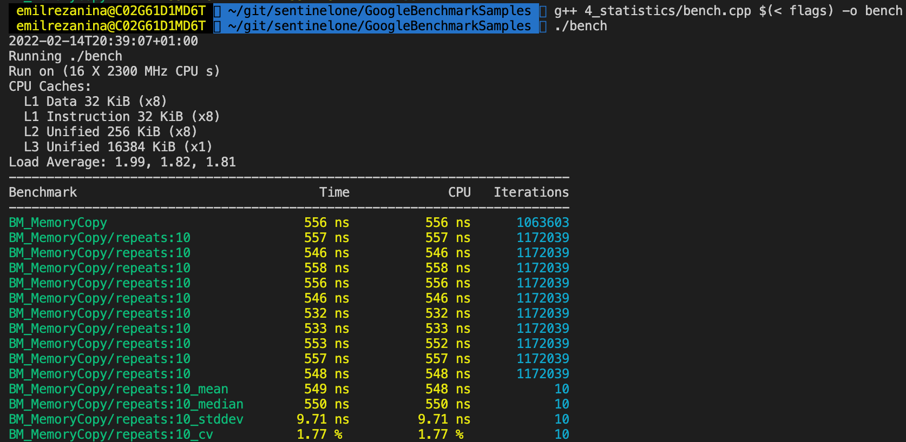
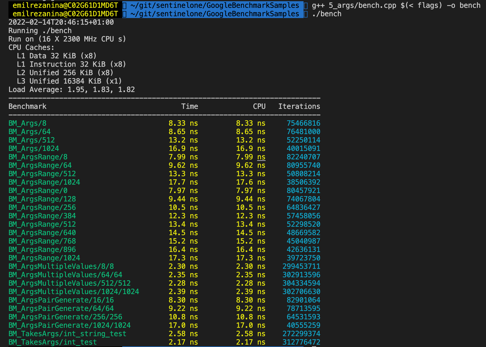
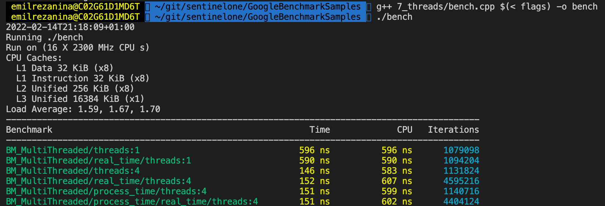
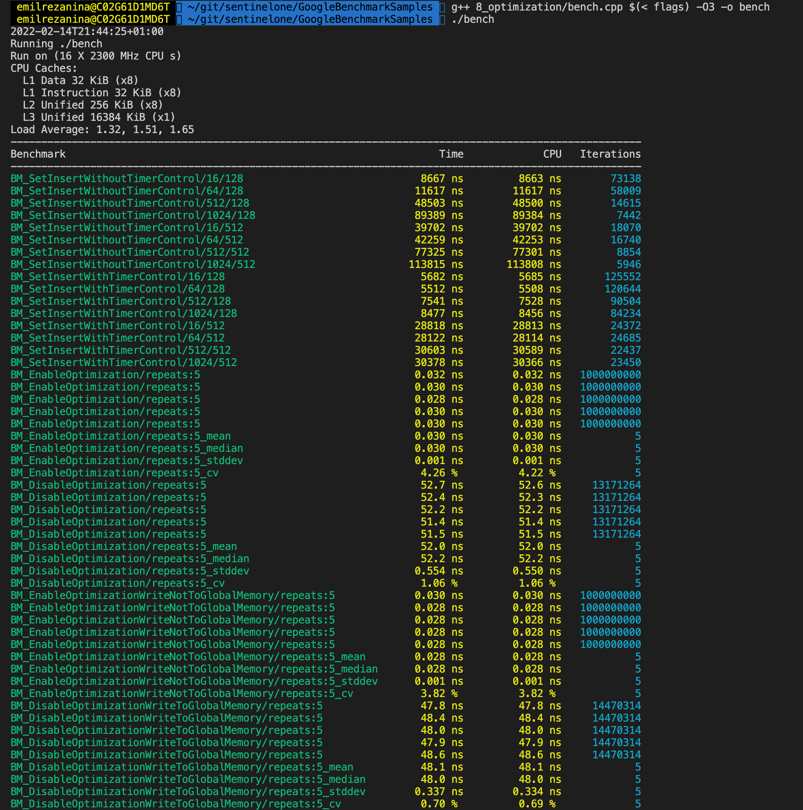
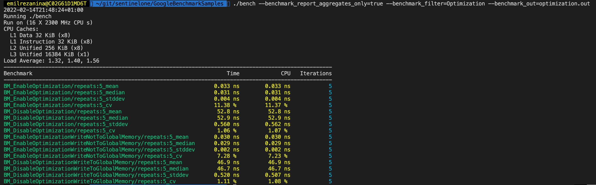

# Overview

This project serves as a demonstration of working with the Google Benchmark framework. We can use it for measuring the performance of something "small". 


## Google/Benchmark

Source code of the Google Benchmark frame can be found [here](https://github.com/google/benchmark#usage).

For more information:

- [User guide](https://github.com/google/benchmark/blob/main/docs/user_guide.md)
- [Benchmark Tools](https://github.com/google/benchmark/blob/main/docs/tools.md)


## Benchmark Structure

```cpp
#include <benchmark/benchmark.h>

static void BM_SomeBenchmarkTest(benchmark::State& state)
{
    // do some staff...
}
//Register benchmark test
BENCHMARK(BM_SomeBenchmarkTest); 

static void BenchSomeAnotherBenchmarkTest(benchmark::State& state)
{
    // do some staff...
}
//Register benchmark test
BENCHMARK(BenchSomeAnotherBenchmarkTest); 

BENCHMARK_MAIN();
```

A benchmark test can be registered several times using the ```BENCHMARK``` macro. All registrations are the executed in the order in which they are registred. For example:

```c++
BENCHMARK(BM_ArgsRange)->Range(8, 1 << 10);
BENCHMARK(BM_ArgsRange)->RangeMultiplier(2)->Range(8, 1 << 10);
BENCHMARK(BM_ArgsRange)->DenseRange(0, 1024, 128);
```

The ```BENCHMARK_MAIN``` macro is used as an entry point into the benchmark test binary.

# Google Benchmark Samples

The individual benchmark test samples are structured into subdirectories and contain ```bench.cpp```, which is used to build the binaries.

## Build

The following flags are used to build binaries:

```
-std=c++11
-isystem /Users/emilrezanina/git/utils/benchmark/include
-L /Users/emilrezanina/git/utils/benchmark/build/src
-lbenchmark 
-lpthread
-fno-exceptions
-fno-rtti
-fno-omit-frame-pointer
-Wall
-pedantic
```

We need to set flags here that will access the installed Google Benchmark framework. First flag is ```-isystem /Users/emilrezanina/git/utils/benchmark/include``` flag to set the path to the benchmark include directory. The second flag is the ```-L ../utils/benchmark/build/src``` flag, which is used to set the path to the benchmark build files.

It is worth mentioning here the following:

- In the flags there is no optimization (such ```-O3```) turned on, which we then turn on during the samples.
- The ```-fno-omit-frame-pointer``` flag is there to preserve the frame pointer if we want to use perf tools over benchmark binaries.

**build**
For individual samples, you need to build the corresponding ```bench.cpp``` file. (*In the following example, this is within the intro directory.*)

```bash
g++ intro/bench.cpp $(< flags) -o bench
g++ intro/bench.cpp $(< flags) -O3 -o bench
```

## Run

Benchmarks are executed by running the produced binaries. Benchmarks binaries, by default, accept options that may be specified either through their command line interface or by setting environment variables before execution. For every ```--option_flag=<value>``` CLI switch, a corresponding environment variable ```OPTION_FLAG=<value>``` exist and is used as default if set (CLI switches always prevails). CLI options can be displayed using the ```--help``` option.

```bash
# Runs all tests that are in the binary.
./bench

# Runs all tsts that are in the binary and contain "String" regex (it is case sensitive)
./bench --bencharmk_filter=String
```

### Outputs

The output from benchmark tests can be either to the console or to a file. The output formats are **console**, **csv**, and **json**. 

By default the output is only to the console and the **console** format is used. This format is human readable. You can change it using the ```--benchmark_format=<console|json|csv>``` option. If you want to output to file, you need to use the ```--benchmark_out=<filename>``` option (and optionally the ```--benchmark_out_format=<console|csv|json>``` option). If you set the ```--benchmark_out=<filename>``` option, the output after tests will be done both to file and to console, but they may have different format settings (it depends on ```benchmark_format``` and ```benchmark_out_format``` options).

Examples:

```bash
./bench --benchmark_format=csv
./bench --benchmark_format=console --benchmark_out=output.json --benchmark_out_format=json
```

TODO: obrazek

We can also add own information to the output using the ```--benchmark_context``` option. For example:

```bash
./bench --benchmark_context=pwd=`pwd`
```

We can use [compare.py](https://github.com/google/benchmark/blob/main/docs/tools.md) to compare the outputs.

## Samples

More Google Benchmark tests can be found in [google/benchmark/test](https://github.com/google/benchmark/tree/main/test).

### Empty state samples

File: [empty_state](./1_empty_state/bench.cpp)

There are two empty benchmark tests. One using a ```for(auto _ : state)``` loop and the other a ```while(state.KeepRunning())``` loop. *First one is faster, because ```KeepRunning()``` requires a memory load and store of the iteration count ever iteration, whereas the ```for(auto _ : state)``` loop is able to keep the iteration count in a register.*

For the **BM_EmptyStateUseForLoop** test we use the settings for the number of iterations and test naming.



### Simple samples

File: [simple](./2_simple/bench.cpp)

It contains two sets of tests in different files. Within [vector_samples.h](./2_simple/vector_samples.h), the ```Args``` is set under benchmark tests.



### Setup/Teardown samples

File: [setup/teardown](./3_setup_teardown/bench.cpp)

Examples of how to setup/teardown tests.

### Statistics sample

File: [statistics](./4_statistics/bench.cpp)

This example shows how to set the number of replicas and then calculate mean, median, stddev, and cv.



### Args samples

File: [args](./5_args/bench.cpp)

These examples show how to work with test inputs. We have used several options here, namely:

- sequence of ```Arg```
- ```Range``` - it use multiplier ```RangeMultiplier``` (default multiplier is 2)
- ```DenseRange``` - it use steps (for example: 0, 1024, 128)
- ```Args``` - multidimensional input
- Apply generate function by ```Apply```
- Template arguments



### User counters samples

File: [user_counters](./6_user_counters/bench.cpp)

We can define custom/predefined counters for tests, which can be shown in output.

For output we set ```--benchmark_coutners_tabulator=true``` option.


### Threads samples

File: [threads](./7_threads/bench.cpp)

If the benchmarked code itself uses threads and you want to compare it to single-threaded code, you may want to use real-time ("wallclock") measurements for latency comparisons:

```c++
BENCHMARK(BM_MultiThreaded)->Threads(4)->UseRealTime();
```

Without UseRealTime, CPU time is used by default.



### Optimization samples

File: [optimization](./8_optimization/bench.cpp)



